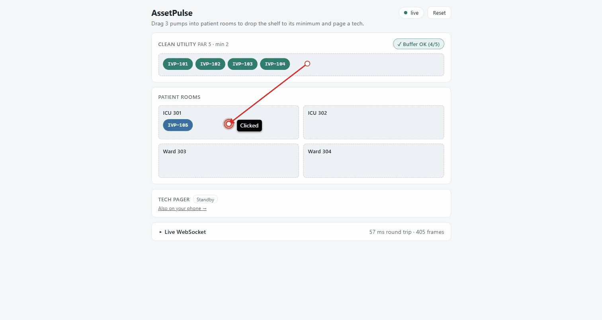
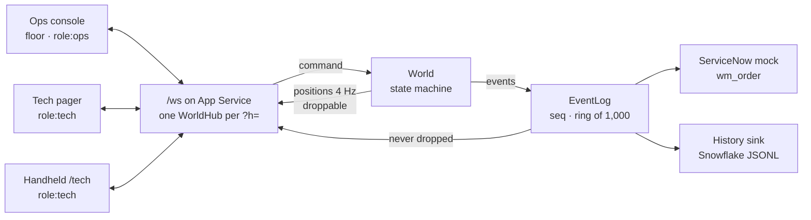

# AssetPulse

A live RTLS demo that runs over WebSockets. A hospital's clean-utility shelf of IV pumps drops
below its PAR level. The server opens a restock work order and pages a tech. The tech accepts and
delivers the order from a handheld, and every screen watching that hospital updates within a
frame. The RTLS tags are simulated on the server, but the socket is real. There is no polling, and
every latency figure and frame count on the screen is measured from actual traffic.

Built as a conversation piece for the GeoSense Tech Lead role. It is not a GeoSense or TRIMEDX
product.

**Live:** https://assetpulse-rtls-gqhhgaf7c5ahe3gv.centralus-01.azurewebsites.net/




## The 30-second pitch

- **One URL, nothing to install.** Each visitor gets their own hospital sandbox (`?h=<id>`). Share
  the link and a second browser or phone joins the same floor.
- **The protocol is the product.** It uses raw `ws` on Node 22, with no Socket.IO or SignalR
  hiding the wire. The protocol has:
  - topic subscriptions
  - a sequenced event stream kept separate from a droppable position stream
  - coalescing and backpressure
  - heartbeats
  - resume from `lastSeq`
  - idempotent commands with acks
  - a clean loser when two techs race for the same order
- **One contract.** `packages/protocol` holds zod schemas for every frame. Server, web, and the
  React Native handheld all import it, so a frame can't drift between them.
- **Stack match.** React 19 for the console, Expo (React Native) for the handheld, and Azure App
  Service for hosting. The work-order shape mirrors ServiceNow `wm_order`, and event history lands
  as Snowflake-shaped JSONL. The ADRs say where APIM, Entra ID, and Azure Web PubSub fit.

## Architecture



Each hospital id gets one server-authoritative `World`. Commands and simulator ticks both produce
events, and every event goes through a single `publish` path:

1. The event log stamps its `seq`.
2. The history sink records it.
3. The ServiceNow adapter sees any work-order change.
4. The event fans out to subscribed sockets.

Because there is only that one path, logging, history, and what clients see can't disagree.

The frames, topics, close codes, and resume algorithm are in [docs/protocol.md](docs/protocol.md).
The design decisions are in [docs/adr/](docs/adr/README.md).

## What to try

1. **Page a tech.** Drag pumps from the Clean Utility shelf into patient rooms. When the shelf
   reaches its minimum of 2, the status shows **Below PAR** and a work order (`WO0010001`) opens.
2. **Work the order.** Accept it in the tech pager, then choose **Complete restock (+3)**. The
   shelf refills and the PAR status clears.
3. **Use a phone.** Choose **Also on your phone →** in the pager. It opens `/tech?h=<same id>`, the
   Expo handheld built for web. Open it on your phone as well, and whichever device accepts first
   wins. The other device's card disappears, because the loser's `accept_wo` is rejected with
   `ALREADY_ASSIGNED`.
4. **Kill the network.** Open the **Live WebSocket** drawer and choose **Drop connection 10 s**.
   While the console is offline, restock from the phone (it has its own socket). When the console
   reconnects, it sends `resume{lastSeq}`, the server replays only what it missed, and a toast
   counts the replayed events.
5. **Read the wire.** The drawer shows every raw frame in both directions, the RTT from real
   `ping` round trips, and the reconnect count. You can also open DevTools → Network → WS → `ws` to
   check the same frames yourself.

## Run locally

Requires Node 22 and npm 10.

```bash
npm install
npm run dev          # server on :8787, console on http://localhost:5173 (proxies /ws)
```

Production build, served exactly as it is on App Service:

```bash
npm run build
node server/dist/index.js   # http://localhost:8787 — console at /, handheld at /tech
```

Checks:

```bash
npm run typecheck && npm run lint && npm test   # Vitest: unit + real-socket integration
npx playwright test                             # e2e dispatch loop (after npm run build)
```

The handheld can also run as a native app: `npm start -w @assetpulse/mobile` (Expo Go).

## Repo map

| Path                | What it is                                                         |
| ------------------- | ------------------------------------------------------------------ |
| `packages/protocol` | zod frame schemas, constants, floor data: the single contract      |
| `packages/client`   | reconnecting client: backoff, resume, command acks, measured stats |
| `server`            | HTTP + `/ws`, world registry, event log, heartbeat, adapters       |
| `web`               | the ops console (React 19 + Vite, CSS Modules)                     |
| `mobile`            | the tech handheld (Expo), also exported to `/tech`                 |
| `e2e`               | Playwright: the full dispatch loop, including a disconnect         |
| `docs`              | protocol reference and ADRs                                        |

## License

MIT
